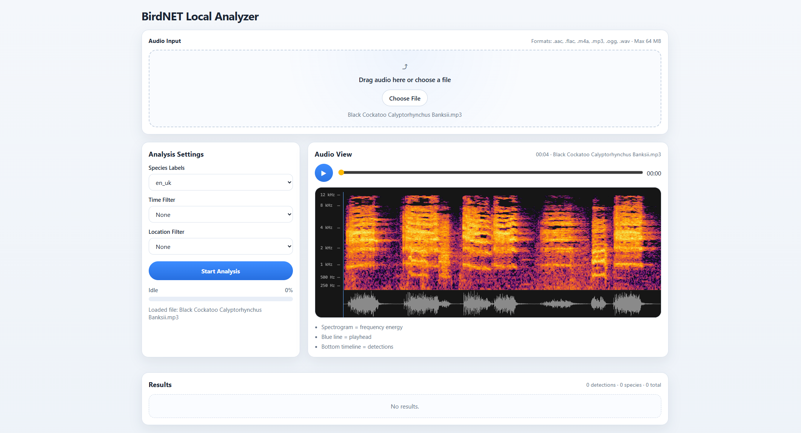
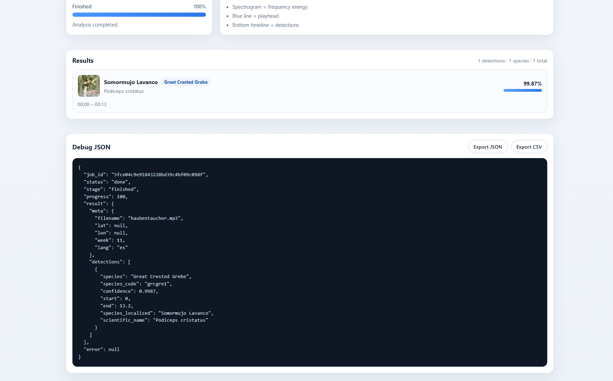
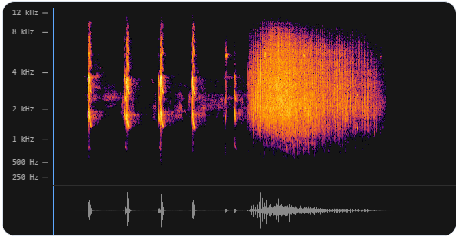

# BirdNET-Analyzer-for-Web



Minimal web interface for the **BirdNET Analyzer**.
Upload an audio file, optionally filter by **date / week** and **geolocation**, and visualizing detected bird species together with their timestamps and spectrogram.

The interface sends audio to a local BirdNET Analyzer instance and displays the results in a modern browser UI.

This project does **not perform bird detection itself**.  
All inference is handled by the BirdNET Analyzer.

---

# Overview

The system consists of three layers:

```
Audio File
   │
   ▼
Web UI (upload + visualization)
   │
   ▼
FastAPI backend
   │
   ▼
BirdNET Analyzer
   │
   ▼
Detection results
```

Processing pipeline:

```
Upload
   │
FFmpeg normalization
   │
BirdNET inference
   │
Detection merging
   │
Localization of species names
   │
Result visualization
```

### Example Result:



---

## Requirements

You need a working **BirdNET Analyzer** installation.

Repository:
https://github.com/birdnet-team/BirdNET-Analyzer

Follow the installation instructions there first.

### Recommended structure:

```
project/
├ birdnet-analyzer-for-web/               # This repository
└ BirdNET-Analyzer/                       # Official BirdNET repository
```

Install BirdNET as editable dependency:
`pip install -e ../BirdNET-Analyzer`

---

## FFmpeg

Audio conversion requires **FFmpeg**.

Install FFmpeg and ensure it is available in your PATH.

Example:
`ffmpeg -version`

---

## Labels

Bird species names come from the BirdNET label files. Place label files in the `/labels` directory.

Available labels:
https://github.com/georg95/birdnet-web/tree/main/models/birdnet/labels

The **en_uk.txt** label file is required due it's the default language.

---

# Features

### Audio analysis

- audio upload
- automatic audio conversion via FFmpeg
- BirdNET inference
- species detection with confidence score

### Visualization

- spectrogram rendering
- waveform timeline
- frequency axis (Hz / kHz)
- detection overlays
- interactive playhead

### Result display

- species list with timestamps
- localized species names
- scientific names
- confidence scores
- clickable detections

### Filtering

Optional environmental filters:

- recording date
- ISO calendar week
- geolocation (latitude / longitude)

These filters significantly improve prediction quality.

### Additional features

- Wikipedia species images
- JSON export
- CSV export
- drag & drop upload
- progress indicator

---

## BirdNET configuration

Two analysis profiles are used.

### With geolocation

When latitude and longitude are available:

```
geo_min_confidence = 0.45
geo_sensitivity = 1.25
```

This allows the model to detect weaker signals because geographic priors reduce unlikely species.

### Without geolocation

When no location data is available:

```
nogeo_min_confidence = 0.6
nogeo_sensitivity = 1.1
```

Higher confidence reduces false positives.

---

# Frontend

The frontend is a lightweight modular JavaScript application.

Main modules:

```
static/
├ api.js
├ app.js
├ audio.js
├ index.html
├ js-colormaps.js
├ styles.css
├ ui.js
├ wave.js
├ wiki.js
```

Responsibilities:

| File            | Purpose                             |
| --------------- | ----------------------------------- |
| api.js          | backend api calls                   |
| app.js          | application bootstrap               |
| audio.js        | Audio file handling                 |
| index.html      | Web-UI                              |
| js-colormaps.js | Provides colormap for spectrogram   |
| styles.css      | UI styling                          |
| ui.js           | UI rendering and event handling     |
| wave.js         | spectrogram and waveform rendering  |
| wiki.js         | Wikipedia species image integration |

---

## Spectrogram

The audio spectrogram is generated entirely in the browser using a custom FFT-based pipeline.
The goal is to visualize time–frequency energy of the signal in a perceptually meaningful way.



#### Processing pipeline:

```
Audio Buffer
│
▼
frame segmentation (sliding window with overlap)
│
▼
windowing (Hann window to reduce spectral leakage)
│
▼
FFT (frequency decomposition)
│
▼
power spectrum (magnitude² → energy per bin)
│
▼
logarithmic scaling (convert energy to decibels)
│
▼
dynamic range normalization (limit to ~70 dB window)
│
▼
logarithmic-frequency interpolation (resample FFT bins to a mel-like axis)
│
▼
contrast compression (log compression + gamma)
│
▼
color mapping (Inferno perceptual colormap)
│
▼
pixel buffer rendering
│
▼
canvas display
```

For color mapping, the renderer uses the **Inferno** colormap from the Matplotlib color family.

The implementation is based on the Matplotlib colormaps provided by:
https://github.com/timothygebhard/js-colormaps

For performance, a 256-entry color table is generated once and reused during rendering.

### Frame analysis

The audio signal is analyzed using a Short Time Fourier Transform (STFT).

Each frame:

```
audio segment
→ Hann window
→ FFT
→ frequency bins
```

Typical parameters:

```
FFT size: 2048
hop size: 256
```

At a sample rate of 44.1 kHz this corresponds roughly to

```
time window ≈ 46 ms
frame step ≈ 5.8 ms
```

This provides high time overlap and good frequency resolution.

Only a subset of the spectrum is visualized:
`150 Hz – 12 kHz`

This removes low-frequency noise and focuses on the most relevant region for bird vocalizations.

---

## Species images

Species images are loaded from Wikipedia using the scientific name.

Example:
`Fulica atra`

The frontend calls the Wikipedia API:
`https://en.wikipedia.org/w/api.php?action=query&prop=pageimages|pageprops&format=json&piprop=thumbnail&titles=Fulica%20atra&pithumbsize=300&redirects`

Images are cached to avoid repeated API requests.

---

## API expectation

The UI expects a backend providing the following endpoints:

```
- GET /                                   # Providing the  static website
- POST /api/analyze
- GET /api/meta/languages
- GET /api/meta/translations/{lang}
- GET /api/meta/config
- GET /api/jobs
- GET /api/jobs/{job_id}
```

---

## Run

Example using a simple Python server:

`uvicorn main:app --reload --port 9050`

Then open:

`http://localhost:9050`

The UI will call the BirdNET Analyzer running on the same host.

---

## Notes

This project is only a **frontend helper for BirdNET Analyzer**.

All machine learning inference and bird detection logic are handled entirely by BirdNET.

## License

This project is licensed under the MIT License.
See the LICENSE file for details.
